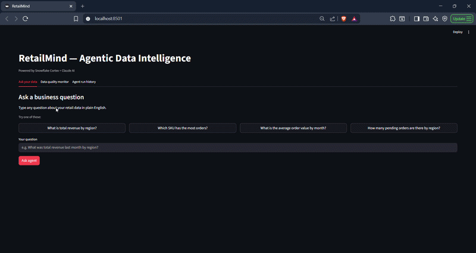

# RetailMind — Agentic Data Intelligence System



## What this is
An end-to-end agentic data engineering project built on Snowflake and Claude AI.
It automatically monitors data quality, diagnoses pipeline issues using LLMs,
and answers business questions in plain English — all backed by a dbt semantic layer.

## Architecture
- **Ingestion**: Raw CSV loaded into Snowflake via Snowpipe
- **Transformation**: dbt models clean and stage the data (stg_orders → orders_mart)
- **Quality Agent**: Runs 5 checks, sends breaches to Claude for root-cause diagnosis
- **Analyst Agent**: Natural language → SQL via Snowflake Cortex + semantic model
- **Dashboard**: Streamlit UI wrapping both agents

## Tech stack
Snowflake · dbt · Snowflake Cortex · Claude API (Anthropic) · Python · Streamlit

## Github structure
retailmind/
├── data/  # raw CSVs (seeded with Python)
├── snowflake/
│ ├── setup.sql
│ ├── tables.sql
│ └── semantic_model.yaml
├── dbt/  # dbt project
│ ├── models/staging/
│ └── models/marts/
├── agents/
│ ├── quality_agent.py
│ └── analyst_agent.py
├── app/  # Streamlit UI
│ └── dashboard.py
└── README.md

## Architecture


## Quick start
```bash
git clone https://github.com/YOUR_USERNAME/retailmind
cd retailmind
python -m venv venv && source venv/bin/activate  # or venvScriptsactivate on Windows
pip install -r requirements.txt
cp .env.example .env  # fill in your Snowflake + Anthropic credentials
python data/generate_data.py
# Load data/orders_raw.csv into Snowflake (see setup guide)
cd dbt/retailmind_dbt && dbt run && cd ../..
streamlit run app/dashboard.py
```

## Sample output
See [examples/sample_analyst_run.txt](examples/sample_analyst_run.txt)
and [examples/sample_diagnosis.json](examples/sample_diagnosis.json)

## What I learned
- Designing semantic layers that make LLMs give accurate business answers
- Agentic patterns: check → diagnose → recommend → log
- Why flagging bad data beats deleting it (the dq_flag pattern)
- Debugging real Snowflake + Python integration issues
